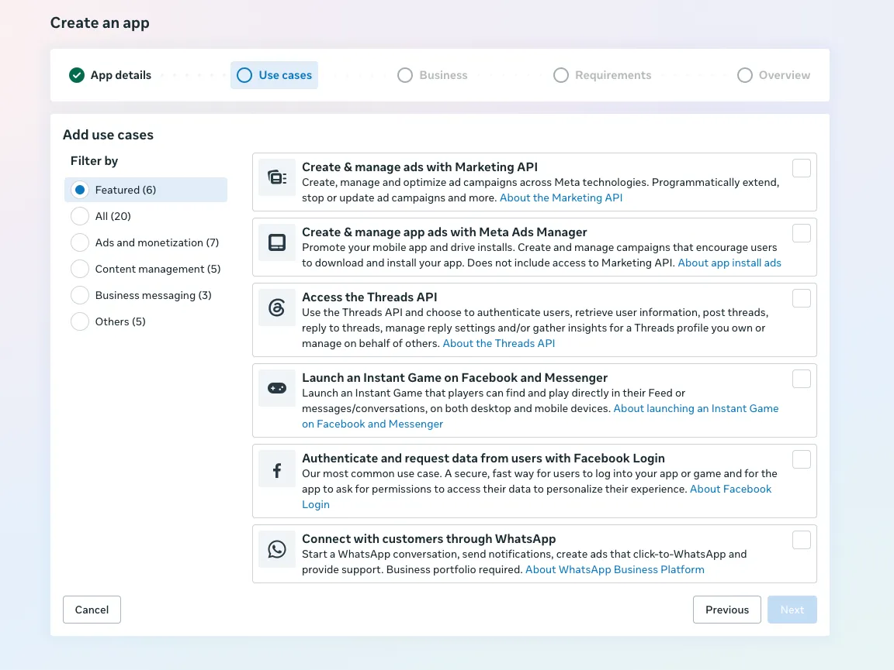

# Meta Ads API notes

How to set up a Meta app so that your own software — not a person clicking around in Ads Manager — can create and manage Facebook/Instagram ads. Plus the field notes we collected while running a real server-to-server ads uploader: rate limits, error codes, and the traps.

("Server-to-server" just means: your program talks directly to Meta's API. No browser, no buttons, no user interface.)

**Who this is for:** you already know Meta ads from the buying side — campaigns, ad sets, Pages, pixels, Ads Manager. What's new is the **developer side**: apps, system users, tokens, App Review. Zero developer knowledge assumed.

**How to read this**

- **Never touched the developer side?** Read in order. Part 1 gives you the picture, Parts 3–5 are the actual setup.
- **Done this before?** Jump to [Part 2](#part-2-three-different-things-called-access) (the naming traps), [Part 6](#part-6-rate-limits-and-errors) (rate limits and error codes), or the [FAQ](#faq).

One honesty rule throughout: Meta's own pages use several names for the same switches, and the docs do not always match what a live API response returns. We separate **what the docs say** from **what we observed**. Trust live `ads_api_access_tier` headers and exact `code` / `error_subcode` pairs over dashboard copy. Official links are at the [bottom](#official-links).

## Contents

1. [Part 1: The big picture](#part-1-the-big-picture)
2. [Part 2: Three different things called "access"](#part-2-three-different-things-called-access)
3. [Part 3: Set up the app (once)](#part-3-set-up-the-app-once)
4. [Part 4: Set up each Advertising BM](#part-4-set-up-each-advertising-bm)
5. [Part 5: Get Full Access](#part-5-get-full-access)
6. [Part 6: Rate limits and errors](#part-6-rate-limits-and-errors)
7. [FAQ](#faq)
8. [Official links](#official-links)

---

## Part 1: The big picture

Exactly three new pieces stand between you and API access:

| Piece | What it is | Picture it as |
|---|---|---|
| **App** | A registered API client with an **App ID** and an **App Secret**. Every API call is made *through* an app. Created on [developers.facebook.com](https://developers.facebook.com/apps). | Your software's ID card |
| **System user** | A machine account inside a Business Manager (BM). Like an employee, but a robot: no login, no personal profile, cannot get banned like a person. Built for API work. | The robot employee |
| **Access token** | A long secret string, generated for a system user through an app, sent along with every API call. | The robot's key badge |

Every API call answers three questions with these pieces: **which software** is calling (the app), **acting as whom** (the system user), and **allowed to touch what** (the assets assigned to that system user).

Two rules follow directly:

- **The app and the system user are different things, and you need both.** The app says *which software* is calling. The system user says *on whose behalf*. The token binds the two together.
- **A token only opens the doors you gave it.** A system user reaches only the ad accounts, Pages, and pixels that were explicitly *assigned* to it — not automatically everything in the BM.

### How we wire it

We run **one** app and **one** pixel, both owned by a **Master BM** that never spends money. The Master BM shares both into every **Advertising BM** — the BMs that hold the actual ad accounts and Pages. Each Advertising BM gets its own system user, and each system user generates its own token:

```text
Master BM ──owns── the app + the pixel
    │
    ├─ shares app + pixel → Advertising BM A
    │                         ├─ ad accounts, Pages live here
    │                         └─ system user A ──generates── token A
    │                             (assigned: A's ad accounts, Pages, pixel)
    │
    └─ shares app + pixel → Advertising BM B
                              ├─ ad accounts, Pages live here
                              └─ system user B ──generates── token B
                                  (assigned: B's ad accounts, Pages, pixel)
```

Why this shape: the Master BM holds the long-lived, hard-to-replace infrastructure (app, pixel, Business Verification) and carries no spend. The Advertising BMs carry the spend — and the restriction risk that comes with it.

### The road from zero to production

1. **Create the app** and pick the **"Create & manage ads with Marketing API"** use case. This automatically puts you on **Limited Access** — a trial mode with tiny rate limits. → [Part 3](#part-3-set-up-the-app-once)
2. **The Master BM owns the app** (and the pixel). → [Part 3](#part-3-set-up-the-app-once)
3. **In each Advertising BM:** share the app and pixel in, create a system user, assign the assets to it, and only then generate the token. → [Part 4](#part-4-set-up-each-advertising-bm)
4. **Make ~500 cheap test calls**, then pass **Business Verification** and **App Review** to reach **Full Access** — the real rate limits. → [Part 5](#part-5-get-full-access)
5. In production: keep a small delay between calls, and **stop** (don't retry) when a rate limiter fires. → [Part 6](#part-6-rate-limits-and-errors)

Do not spend days trying to live inside Limited Access. Its rate budget (a **60-point score**, see Part 6) burns out almost immediately for a real uploader. Wire a token, make the warmup reads, then go for Full Access. That is the path that saves time.

---

## Part 2: Three different things called "access"

The biggest trap first: three **independent** switches share almost the same English words. Turning on one does not turn on the others.

| Phrase | What it really is | Where you set it |
|---|---|---|
| **Full control** | How much a *system user* may do with an asset assigned to it (app, ad account, Page) | Business Settings → System users |
| **Full Access** | The Marketing API **Access Tier**: your app's rate-limit class and API surface | App Dashboard → App Review → **Marketing API Access Tier** |
| **Advanced Access** | A per-*permission* / per-feature level in Graph API (e.g. on `ads_management`) | App Dashboard → App Review → that permission or feature |

Meta also **renamed the tier** and did not update every page:

| UI today | Older UI / some pages still say | Value in live headers |
|---|---|---|
| **Limited Access** (the default) | "Development access"; "Standard Access" to *Ads Management Standard Access* | `development_access` |
| **Full Access** (after App Review) | "Advanced Access" to that same feature | `standard_access` |

Yes, really: the header calls Full Access `standard_access`. This is where most "standard access is enough, you don't need App Review" confusion comes from.

Sources: [Authorization](https://developers.facebook.com/documentation/ads-commerce/marketing-api/get-started/authorization), [Rate limiting](https://developers.facebook.com/documentation/ads-commerce/marketing-api/overview/rate-limiting), [Access levels](https://developers.facebook.com/docs/graph-api/overview/access-levels).

Live proof of your tier is the `ads_api_access_tier` field inside the `X-Business-Use-Case-Usage`, `X-Ad-Account-Usage`, or `X-FB-Ads-Insights-Throttle` response headers.

---

## Part 3: Set up the app (once)

### Create it

System users call the API **through an app**, so the app comes first. Create it at [developers.facebook.com/apps/creation](https://developers.facebook.com/apps/creation/). The wizard walks through **App details → Use cases → Business → Requirements → Overview**. On the use-case step, pick **Create & manage ads with Marketing API** — for an ads uploader that is all you need; it attaches the Marketing API product and its permissions:



(Meta's docs also describe a generic **Other → Business** path for apps that don't fit a listed use case — [other app types](https://developers.facebook.com/documentation/development/create-an-app/other-app-types). You don't need it for ads.)

On the **Business** step, connect the app to the BM that should own it — the Master BM, see next section.

The app gets an **App ID** and an **App Secret**. The secret is a password: keep both private and never commit them to git. How you name and store them is up to you.

### The Master BM owns the app (and the pixel)

The BM that owns (or has claimed) the app needs a real person as admin, and a system user can only be given a **role on an app** if the system user and the app belong to the **same business** ([system user overview](https://developers.facebook.com/docs/business-management-apis/system-users/overview)). For acting on behalf of a completely different business, Meta's answer is [On Behalf Of](https://developers.facebook.com/docs/marketing-api/business-manager/guides/on-behalf-of/).

**What we do:** a **Master BM** that never spends owns the app and the pixel, and shares/claims both into each Advertising BM. Recreating the app for token repair or for a new BM is usually unnecessary — and app *creation* is the step that tends to trigger extra verification checks, so don't do it more often than needed.

### How many system users the app-owning BM gets

Meta caps system users on the BM that **owns the app**, and the cap follows the access tier ([overview](https://developers.facebook.com/docs/business-management-apis/system-users/overview)):

| Tier (old names in that doc) | System users | Admin system users |
|---|---|---|
| Standard (= Limited tier) | 1 | 1 |
| Advanced (= Full Access tier) | 10 | 1 |

The admin system user stays capped at 1 on purpose: use it to create and manage the other system users, not as the everyday ads token.

---

## Part 4: Set up each Advertising BM

Repeat these six steps for every Advertising BM you operate. Official docs: [System Users](https://developers.facebook.com/docs/business-management-apis/system-users), [create](https://developers.facebook.com/docs/business-management-apis/system-users/create-retrieve-update), [install app + tokens](https://developers.facebook.com/docs/business-management-apis/system-users/install-apps-and-generate-tokens), [assign assets](https://developers.facebook.com/docs/business-management-apis/system-users/guides/permissions), [Help Center](https://www.facebook.com/business/help/503306463479099?id=2190812977867143).

1. **Share the app (and the pixel) from the Master BM into the Advertising BM.** The app via the Master BM's app settings, the pixel via Business Settings → Data sources. Check that it worked: the app must appear under the Advertising BM → Business Settings → **Apps**. Do not continue until it does.

2. **Create an Admin system user in that BM.** (A regular system user is fine if an admin one already exists.) Every Advertising BM gets its own system user — [why below](#one-app-shared-into-every-bm-one-system-user-per-bm--why).

3. **Assign the app to the system user, with Full control.** Business Settings → System users → select the user → Assign assets → Apps. If you skip this, the permissions you request later will silently not be available on the token.

4. **Assign this BM's ad accounts, Pages, and the shared pixel to the system user.** For ad accounts we use the tasks `MANAGE`, `ADVERTISE`, `ANALYZE`. Pages are a **separate** assignment — a Page that merely sits in the same BM is not enough. A missing Page assignment typically shows up later as error `code 10` / `subcode 1341012`.

5. **Now generate the token — only after steps 3–4.** Tokens are snapshots: they do **not** pick up assets or permissions granted later. If you fix an assignment afterwards, generate a fresh token.

   Via API: `POST /{system-user-id}/access_tokens` with `business_app`, `scope`, and `appsecret_proof`. Meta now prefers **60-day expiring** tokens (`set_token_expires_in_60_days=true`); some businesses cannot generate non-expiring ones at all. Expiring tokens need a scheduled refresh job ([token docs](https://developers.facebook.com/docs/business-management-apis/system-users/install-apps-and-generate-tokens)).

   Treat the token like a password: never commit it to git, never paste it into tickets or chats.

6. **Check the token before moving to the next BM:**

   ```text
   GET /debug_token?input_token=TOKEN        # authenticate with app_id|app_secret
   GET /{business_id}?fields=id,name         # using the new token
   ```

   Expect: token valid, bound to **your** App ID, all requested permissions present, BM id matching this BM. The [Access Token Debugger](https://developers.facebook.com/tools/debug/accesstoken/) shows the same in a browser.

### Which permissions (scopes) to put on the token

For an uploader that creates campaigns / ad sets / ads, reads reports, and works with Pages:

| Scope | Why |
|---|---|
| `ads_management` | Create / edit campaigns, ad sets, ads |
| `ads_read` | Read configuration and reports |
| `business_management` | BM assets, system users — and your lifeline if a personal profile gets banned (see [FAQ](#why-not-personal-profiles-instead-of-system-users)) |
| `pages_read_engagement` | Page-side reads for Page-linked ads |
| `pages_manage_ads` | Ads that run from a Page |
| `pages_show_list` | List the Pages the token can see |

Optional, only if you actually use them: `pages_manage_posts`, `pages_manage_engagement`, `read_insights`.

Request what you need **at generation time** (snapshot rule above). Allowed system-user scopes: [install apps and generate tokens](https://developers.facebook.com/docs/business-management-apis/system-users/install-apps-and-generate-tokens). Full catalog: [Permissions](https://developers.facebook.com/docs/permissions).

**What we run:** one token per Advertising BM, holding only that BM's assets. A single "hub" token that can reach every BM concentrates leak and restriction risk in one string. That is our operating choice, not a Meta requirement.

---

## Part 5: Get Full Access

### Why bother

Adding the Marketing API product gives your app **Limited Access** automatically. Meta's own wording: Limited is "for development only. Not for production apps running for live advertisers." ([Authorization](https://developers.facebook.com/documentation/ads-commerce/marketing-api/get-started/authorization))

| | Limited (default) | Full Access (after App Review) |
|---|---|---|
| How you get it | Add the Marketing API product | Upgrade the **Marketing API Access Tier** |
| Rate limits | Heavy, per ad account; documented as development-only | Much higher, still per ad account |
| Score cap (see Part 6) | **60 points**, decay 300 s, block 300 s | **9000 points**, decay 300 s, block 60 s |
| BUC `ads_management` calls/hour | `300 + 40 × active_ads` | `100000 + 40 × active_ads` |
| BUC `ads_insights` calls/hour | `600 + 400 × active_ads` (minus an error term) | `190000 + 400 × active_ads` (minus an error term) |
| System users on the app-owning BM | 1 + 1 admin | 10 + 1 admin |
| Business Manager / Catalog APIs | Limited | Full surface |
| Creating Pages via API | Not possible | Still not possible |
| Business Verification | Not required | Required for the upgrade |

**What we observed on Limited:** the 60-point score is the first wall a real uploader hits. Not every endpoint clearly counted toward it, and the docs do not list which ones do. Fighting that cap costs more time than App Review does. Go to Full Access instead of engineering around Limited.

### Step 1 — Warm up: 500 calls

The upgrade unlocks after:

- **≥ 500 successful Marketing API calls** in the last 15 days, and
- an error rate **below 15%** on the last 500 calls.

Cheap **reads** against accounts you already admin are enough: `/me/adaccounts`, a campaign GET, a Page GET — repeated until the dashboard counters are there. Keep the error rate down; retry loops on failing calls work against you. Calls from the [Graph API Explorer](https://developers.facebook.com/tools/explorer/) count too.

Also make at least one successful call per permission you will request, within 30 days of submitting ([submission guide](https://developers.facebook.com/documentation/resp-plat-initiatives/individual-processes/app-review/submission-guide)).

### Step 2 — Business Verification

Meta checks that a real, legal business is behind the app. **Not required** on Limited — you can create the app, generate a token, and test without it. **Required** for the Full Access upgrade: Business Verification has been mandatory for Advanced Access since 1 Feb 2023 ([announcement](https://developers.facebook.com/blog/post/2023/02/01/developer-platform-requiring-business-verification-for-advanced-access/)), and the App Review form usually blocks submission until it is done.

It is a **separate process** from App Review, even though the dashboard nests the prompt inside it. It can ask for documents and can take longer than the review itself.

How:

1. App Dashboard → **Settings → Basic → Verification** → connect the app to the Business that should own it — the **Master BM**, not an Advertising BM, if you split those.
2. An **admin of that Business** finishes verification inside Business Manager. App admins cannot finish it unless they are also BM admins.
3. Have documents ready: legal name, address, phone, website, and business papers (registry extract, tax letter, utility bill — whatever the form requests for your country). Full list: [About Business Verification](https://www.facebook.com/business/help/1095661473946872).
4. Building the app for a client who will own it? Verify **their** business, not yours ([S2S apps](https://developers.facebook.com/documentation/development/create-an-app/server-to-server-apps)).

### Step 3 — App Review

Where: App Dashboard → App Review → Permissions and Features → **Marketing API Access Tier** → **Upgrade**. Before you can submit, the app also needs its basics filled in under Settings → Basic: a **privacy policy URL**, an icon, and the Website platform with your company URL.

The generic review flow ([tutorial](https://developers.facebook.com/documentation/resp-plat-initiatives/individual-processes/app-review/submission-guide)) assumes an app with buttons and a login dialog. A server-to-server app has neither — follow the [Server-to-Server Apps](https://developers.facebook.com/documentation/development/create-an-app/server-to-server-apps) page as well.

**What the form actually asked (our July 2026 submission):**

1. **Permission usage** — one free-text box per requested permission/feature: *"Tell us how you're using this permission or feature."* Write a **distinct** paragraph for each (Meta asks you not to paste the same text everywhere): what the system does, that it is server-to-server with no UI, which concrete calls this permission covers, and that all activity targets ad accounts you own.
2. **Data handling** — the legal entity responsible for the data, and every data processor that touches Platform Data (your hosting, database, and messaging vendors), each with its countries.
3. **Web reviewer instructions** — the trap for S2S apps: the reviewer expects to click through a login flow. Explain it head-on: no Facebook Login, no OAuth dialog, no UI; permissions come from assigning Business assets to a system user in Business Settings; therefore the standard "user grants permission in the login dialog" recording cannot exist. Then describe in text, per permission, what the backend does end-to-end — e.g. which command creates a **paused** campaign / ad set / ad and where those objects appear in Ads Manager, and which reads reconcile state back. Offer API logs, request/response samples, or a live walkthrough on request. We attached **no screen recording at all** — the review went through without one.
4. **"Is Facebook Login integrated?"** — No.
5. **Optional payment / gift-code / geo-restriction questions** — all N/A for a backend tool; say so explicitly instead of leaving them blank.

Result: the Marketing API Access Tier plus the scopes above came back approved in about **two hours**. One data point on one app — not a promise, and not the same thing as Business Verification.

Drafting trick: paste the S2S doc page, each permission's official "Allowed Usage" text, and one paragraph about what your uploader does into a language model, and have it write a distinct usage box per permission.

### Step 4 — Publish the app

Meta's older docs call this **Development vs Live mode** and warn that in Live, permissions that were never approved stop working even for your own team. The current dashboard shows it as **Unpublished / Published** instead. Some features only work once the app is published — publish it after the review passes.

### One more distinction

If **other businesses'** ad accounts will authorize your app (they click "Allow"), you also need **Advanced Access** on the `ads_management` / `ads_read` permissions. If you only manage accounts you already admin, **standard access** on those permissions is documented as sufficient ([Authorization](https://developers.facebook.com/documentation/ads-commerce/marketing-api/get-started/authorization)) — but you still want the **tier** upgrade, because the tier is what raises your rate limits.

---

## Part 6: Rate limits and errors

Think of rate limits as **several independent speed limits on different roads**. Hitting one does not mean the others are close, and they do not share one number. The Marketing API is excluded from the generic Graph Platform user/app call buckets — it has its own limiters. ([Rate limiting](https://developers.facebook.com/documentation/ads-commerce/marketing-api/overview/rate-limiting), [BUC headers](https://developers.facebook.com/docs/graph-api/overview/rate-limiting/))

The error subcodes below were observed on Graph **v25.0**. Meta reuses and renames them; treat each `code` / `error_subcode` **pair** as a lookup key, not a stable contract.

### The levels

| Level | What it covers | What stops there |
|---|---|---|
| **App** | Every call this app makes, across all ad accounts | Insights platform limiter (`4/1504022`, `4/1504039`); generic code `4` |
| **App + ad account** | One account, through this app | Mutation cap of 100 QPS (`613/5044001`); the score cap also lives per account and follows the **app's** tier |
| **Ad account + use case (BUC)** | One account, one Business Use Case (`ads_management`, `ads_insights`, `custom_audience`, Pages, …) | `80004` / `80000` / `80003` / `80014` — sibling accounts and other use cases stay open |
| **Ad account** | One account, independent of use case | Abuse throttle: `613` with **no** subcode; spend-cap edit limit; ad-creates vs. daily spend |
| **One ad set** | Graph updates to that ad set's `daily_budget` / `lifetime_budget` | 4 changes/hour, then blocked 1 h (`613/1487632`) |

So: a throttle on account A's `ads_management` use case does not, by itself, block account B — or even Insights on A. But an **app-level** Insights platform throttle blocks Insights for every account on the app.

### Every signal in one table

| System | Typical signal | Scope | Notes |
|---|---|---|---|
| Ad-account **score** | `17/2446079`, `613/1487742`, `X-Ad-Account-Usage` header | ad account | Reads count ~1 point, writes ~3. Cap 60 (Limited) vs 9000 (Full) |
| BUC `ads_management` | `80004`, `X-Business-Use-Case-Usage` header | ad account + use case | Hourly formula in the Part 5 table |
| BUC `ads_insights` | `80000` | ad account + use case | Separate quota |
| Insights **platform** | `4/1504022`, `4/1504039` | **whole app**, Insights | Capacity undocumented |
| Mutation **QPS** | `613/5044001` | app + ad account | 100 QPS on campaign / ad set / ad create + edit |
| App-wide | code `4` without the Insights subcodes | whole app | |
| Abuse prevention | `613` with **no** subcode | ad account | Meta reduced your quota; contact support, do not retry harder |
| Spend-cap edits | `17/1885172` | ad account | 10/day — a business rule, not a "retry later" throttle |
| Ad-set budget edits | `613/1487632` | one ad set | 4/hour, then 1 h block |
| Ad creates vs. spend | `613/1487225` | ad account | Tied to the account's daily spend limit |

### What the headers actually tell you

The usage headers report **percentages** and a recovery estimate. They do **not** report remaining calls, remaining score points, or `active_ads`.

`X-Business-Use-Case-Usage` example:

```json
{
  "BUSINESS_ID": [{
    "type": "ads_management",
    "call_count": 45,
    "total_cputime": 80,
    "total_time": 30,
    "estimated_time_to_regain_access": 0,
    "ads_api_access_tier": "standard_access"
  }]
}
```

`call_count` / `total_cputime` / `total_time` are 0–100+ percentages. Heavy Insights queries can max out CPU while the call count still looks low.

Watch the units: BUC `estimated_time_to_regain_access` is in **minutes**; `X-Ad-Account-Usage.reset_time_duration` is in **seconds**.

**What we observed:** on Limited, `X-Ad-Account-Usage` was often simply **absent**, while the BUC percentages moved with raw HTTP calls. A missing header means "no new information", not "you are at 0". We do not try to keep a local 1-point/3-point ledger from these headers.

**Practical handling (ours):** when a real throttle fires, **stop** — retries extend the block window. Classify by exact `code`/`subcode`. Keep a small delay between calls. Never retry `102` / `190` (auth errors) with the same token.

### Notes that affect every call

- Send the token as `Authorization: Bearer …` **and** send `appsecret_proof` computed over that same token ([secure requests](https://developers.facebook.com/docs/graph-api/guides/secure-requests)).
- Pin a Graph version (we use `v25.0`); never call unversioned endpoints.
- `paging.next` URLs often embed the access token — strip it before logging.
- A `5xx` or a missing body after a POST may still have **applied**. Read the object back before sending the same POST again.

---

## FAQ

### I have a system user — do I still need an app?

Yes. The app is the API client ("which software"), the system user is the identity ("acting as whom"). One does not replace the other. [System Users](https://developers.facebook.com/docs/business-management-apis/system-users)

### Can I stay on an unverified, Limited app?

For wiring a token and a few test calls: yes. Business Verification is **not** required on Limited. But Meta documents Limited as not for production, and the score cap is 60 points.

We would not stay there. Do the warmup, verify the business, submit for Full Access. That is faster than living with the cap.

The claim "standard access is enough, App Review is only for advanced permissions" usually mixes up **permission** standard/advanced with the **Marketing API Access Tier**. The headers call Full Access `standard_access` — see [Part 2](#part-2-three-different-things-called-access) — which is exactly how that mix-up happens.

### One app shared into every BM, one system user per BM — why?

That is what we run (diagram in [Part 1](#part-1-the-big-picture)). A token only reaches assets **assigned** to its system user; it does not automatically see every account in the BM.

The official constraint behind it: system user and app must belong to the same business for the system user to get a **role on the app**. Sharing/claiming the app from the Master BM into the Advertising BM is the step that makes the app available there. If that path fails, Meta's alternative is [On Behalf Of](https://developers.facebook.com/docs/marketing-api/business-manager/guides/on-behalf-of/).

### Why not personal profiles instead of system users?

Meta documents system users for servers making API calls. User access tokens follow Facebook Login, expire (`expires_at`, often also `data_access_expires_at`), and attach every action to a person.

And the part people underestimate: **personal profiles get banned; system users don't ride along.** We have seen exactly this play out: a personal profile that administered a BM got banned — but the system-user token kept working. API access to the BM and its ad accounts stayed up, and because the token had `business_management`, it could even send BM invites via API to bring a human admin back in. Give the token `business_management` plus the ad and Page scopes for exactly this reason.

### Why not several apps, rotating when limits hit?

We run **one** app and take Full Access. Extra apps can only split the **app-wide** limiters (code `4`, Insights platform). The score and BUC limits are per ad account and stay Limited-sized if those extra apps were never reviewed. Classify the `code`/`subcode` before adding surface area — `613` with no subcode is abuse prevention, and more apps make that worse, not better.

If you are already on Full Access and creates fail with `613/5044001`, that is the **100 QPS** mutation cap: slow down instead of adding apps.

### People say BMs get disabled because of "bad API setup"

We cannot verify other people's bans. What we avoid: profile tokens for automation, one token holding assets from many BMs, bursting mutations, retry loops on throttles, and a farm of unreviewed apps. What we do: verified Business, reviewed app, one system user per BM, assigned assets only, header-aware pacing.

---

## Official links

### App, verification, review, tiers

- [Server-to-server apps](https://developers.facebook.com/documentation/development/create-an-app/server-to-server-apps)
- [Business Verification (developers)](https://developers.facebook.com/documentation/development/release/business-verification)
- [About Business Verification (Help Center)](https://www.facebook.com/business/help/1095661473946872)
- [Advanced Access requires Business Verification (Feb 2023)](https://developers.facebook.com/blog/post/2023/02/01/developer-platform-requiring-business-verification-for-advanced-access/)
- [Access levels](https://developers.facebook.com/docs/graph-api/overview/access-levels)
- [App Review](https://developers.facebook.com/documentation/resp-plat-initiatives/individual-processes/app-review)
- [App Review submission guide](https://developers.facebook.com/documentation/resp-plat-initiatives/individual-processes/app-review/submission-guide)
- [Authorization (Limited vs Full, permissions vs tier)](https://developers.facebook.com/documentation/ads-commerce/marketing-api/get-started/authorization)
- [Marketing API Access Tier](https://developers.facebook.com/docs/features-reference#marketing-api-access-tier)
- [Other app types](https://developers.facebook.com/documentation/development/create-an-app/other-app-types)
- [Permissions](https://developers.facebook.com/docs/permissions)
- [App Dashboard](https://developers.facebook.com/apps)

### System users and tokens

- [System Users](https://developers.facebook.com/docs/business-management-apis/system-users)
- [Overview, types, limits](https://developers.facebook.com/docs/business-management-apis/system-users/overview)
- [Create / retrieve / update](https://developers.facebook.com/docs/business-management-apis/system-users/create-retrieve-update)
- [Install apps, generate / refresh / revoke tokens](https://developers.facebook.com/docs/business-management-apis/system-users/install-apps-and-generate-tokens)
- [Assign ad accounts and Pages](https://developers.facebook.com/docs/business-management-apis/system-users/guides/permissions)
- [Help Center: add a system user](https://www.facebook.com/business/help/503306463479099?id=2190812977867143)
- [On Behalf Of](https://developers.facebook.com/docs/marketing-api/business-manager/guides/on-behalf-of/)
- [Access Token Debugger](https://developers.facebook.com/tools/debug/accesstoken/)
- [Graph API Explorer](https://developers.facebook.com/tools/explorer/)
- [Secure requests / appsecret_proof](https://developers.facebook.com/docs/graph-api/guides/secure-requests)

### Rate limits and errors

- [Marketing API rate limiting](https://developers.facebook.com/documentation/ads-commerce/marketing-api/overview/rate-limiting)
- [Graph API / BUC rate limits](https://developers.facebook.com/docs/graph-api/overview/rate-limiting/)
- [Insights best practices](https://developers.facebook.com/documentation/ads-commerce/marketing-api/insights/best-practices)
- [Error handling](https://developers.facebook.com/docs/graph-api/guides/error-handling)
- [Marketing API error reference](https://developers.facebook.com/docs/marketing-api/error-reference/)

### Changelogs

- [Marketing API changelog](https://developers.facebook.com/docs/marketing-api/marketing-api-changelog/versions/)
- [Graph API changelog](https://developers.facebook.com/docs/graph-api/changelog)
- [Meta Developer blog](https://developers.facebook.com/blog/)
- [Developer Community](https://developers.facebook.com/community/)
